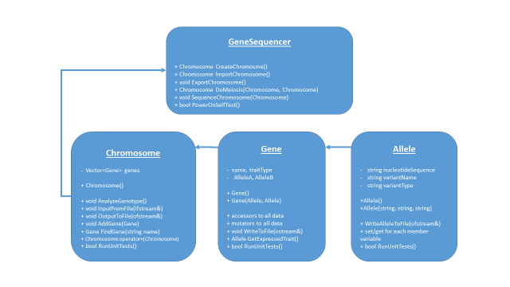

#Gene Sequencer

##Programming Assignment \#5

**Learning Objectives**

This project provides: experience writing classes, using file streams,
functions, references, and unit tests. It is also a review of flow
control logic, selection, and looping.

**Summary**

The goal of this program is to author a "Gene Sequencer". Our gene
sequencer will be a bit simpler than the real thing -- but it will be a
great way to demonstrate how thinking about and modeling a complex
process or machine can be done with object oriented programming (OOP).

The Gene Sequencer will allow a user to create chromosome pair objects,
analyze them and combine them (meiosis) to form new types of
chromosomes. Our simplified model of chromosome pairs will be
collections of genes. Each gene will have two alleles -- one of these
alleles will be dominant and therefore expressed. The other will be
recessive and not expressed. When the Gene Sequencer analyzes the
chromosome, the dominant alleles will be output as the genotype. The
image below shows the relationship of the chromosome pair, genes and
alleles.

Diagram 1 - Relationship of Alleles to Genes

The point of the assignment is to practice object oriented design and
programming (OOD/OOP) The theme of the assignment loosely follows
biological science and technology specific to genetics. Hopefully this
gives the programming assignment an interesting theme for you. Please
don't get tripped up on the theme -- it is not necessary to understand
the biology to program the assignment.

##Specification - Part A

1.  Create a user menu that displays a menu of choices until user
    selects "Exit". The menu functionality should be written as a
    function in main.cpp and contain at minimum the following choices;

    -   1 -- Create chromosome

    -   2 -- Analyze chromosome

    -   3 -- Output chromosome to file

    -   4 -- Input chromosome from file

    -   5 -- Combine chromosomes

    -   6 -- Exit

2.  Design and define the program's classes. The program uses Object
    Oriented Programming (OOP) concepts to model the problem. See
    diagram below that shows the class architecture and public
    interfaces. You are free to add additional classes and methods,
    however, the program must define at minimum the following classes;

    -   Allele

    -   Gene

    -   Chromosome (or ChromosomePair)

    -   GeneSequencer

Diagram 2 - Class Relationships

3.  Implement Input/Output functionality - the program allows a user to
    write and read chromosome data to/from a file. Each class has
    methods to either write to a file, read from a file or to do both.

    -   The file format is a comma separated (csv) file that contains in
        each row the data for a gene.

    -   The exact format in the order it should be written and read from
        the file for each row is;

> *\<gene name\>, \<gene trait\>, \<alleleA variant\>, \<alleleA type\>,
> \<alleleA nucleotide sequence\>, \<alleleB variant\>, \<allele
> type\>,\<alleleB nucleotide sequence\>*

-   A specific example of the data for two (2) genes in csv format is:

> *UH56,hair color,blonde,recessive,TTCC,Dark,dominant,CCAGG*
>
> *WPM987,Cancer-L,High,recessive,TCGC,Low,dominant,CATGG*

4.  Display the genotype - the program allows a user to view the
    genotype of a chromosome (AnalyzeGenotype method). The genotype is
    determined by selecting the dominant or 'expressed' allele of each
    gene in the Chromosome and displaying the list of expressed genes in
    the following format.

> *Gene 1*

-   *Name: UH56*

-   *Genetic trait: Hair color*

-   *Expressed allele: Dark -- dominant *

-   *Nucleotide sequence: CATGTAC*

> *Gene 2 ...*

##Specification -- Part B**

Part B adds additional "advanced" functionality, and builds out a set of
power on self-tests (POST tests) typical on an embedded device. The
class definitions for the GeneSequencer and Chromosome classes are
provided below. You are free to add additional public or private methods
and data, however, you must implement the specified methods in the class
definitions below;

5.  Implement all remaining functionality described in the following
    class definitions

class GeneSequencer{

    public:

        // default constructor

        ChromosomePair  CreateChromosomePair();

        // returns a chromosome object from data in \'filename\'

        ChromosomePair  ImportChromosomePair(const string& fileName =
\"\");

        // saves chromosome \'c\' data to file \'filename\'

        void ExportChromosomePair(ChromosomePair c, const string&
fileName = \"\");

        // returns chromosome from \'x\' and \'y\' genes - allele
selection is random

        ChromosomePair  DoMeiosis(ChromosomePair x, ChromosomePair y);

        // outputs genotype (dominant alleles for each gene) in \'c\'

        void SequenceChromosomePair(ChromosomePair c);

        // executes all unit tests on each object. Returns true if all
tests pass

        bool PowerOnSelfTest();

lass ChromosomePair{

    public:

        // default constructor

        ChromosomePair();

        // outputs genotype which is each dominant allele in each gene

        void AnalyzeGenotype();     

        // configures this chromosome with data from filestream \'ifs\'

        void    InputFromFile(ifstream& ifs);

        // writes the state data from this chromosome to filestream
\'ofs\'

        void    OutputToFile(ofstream& ofs);

        // adds a new Gene object \'g\' to a collection in this object

        void    AddGene(Gene g);

        // returns a Gene object that matches a Gene with name \'n\'

        Gene    FindGene(string n);

        // returns a chromosome that is a recombination of one Allele
from each of two genes - random selection

        ChromosomePair operator+(ChromosomePair rhs);

        bool RunUnitTests();

    private:

        vector\<Gene\>    genes;

        string          fileName;

};

6.  Implement unit tests for each class. Implement a "POST" or
    PowerOnSelfTest() in the GeneSequencer class that will call each
    classes unit tests.

7.  Separate each class into its own header (.h) and implementation
    (.cpp) file with correct header guards

8.  Archive project to your github account

**Sample Output**

***Here is an example of a valid user interaction output for the
program:***

Menu Display

> MENU
>
> 1 -- Create chromosome
>
> 2 -- Analyze chromosome
>
> 3 -- Output chromosome to file
>
> 4 -- Input chromosome from file
>
> 5 -- Combine chromosomes
>
> 6 -- Exit
>
> Please enter your choice (1 -- 5)

User selects menu item 1

> What is the name of the new gene? (e.g. TZ458)
>
> *USER INPUT: UH56*
>
> What is the gene trait? (e.g. eye color)
>
> *USER INPUT: Hair Color*
>
> What is the allele 1 variant ? (e.g. brown/blue/etc.)
>
> *USER INPUT: Blonde*
>
> What is allele 1 type? (e.g. dominant or recessive)
>
> *USER INPUT: recessive*
>
> What is allele 1 nucleotide sequence? (e.g. AGTC)
>
> *USER INPUT: TTCC*
>
> What is the allele 2 variant ? (e.g. brown/blue/etc.)
>
> *USER INPUT: Dark*
>
> What is allele 2 type? (e.g. dominant or recessive)
>
> *USER INPUT: dominant*
>
> What is allele 2 nucleotide sequence? (e.g. AGTC)
>
> *USER INPUT: CCAGG*
>
> Would you like to add a new gene? (y/n)
>
> *USER INPUT: n*

User selects menu item 2

> Name: UH56
>
> Genetic trait: Hair color
>
> Expressed allele: Dark -- dominant
>
> Nucleotide sequence: CCAGG

User selects menu item 3

What file would you like to import from?

> *USER INPUT: test.txt*
>
> *A chromosome object is created and available for analysis based on
> test.txt*

User selects menu item 4

What file would you like to export to?

> *USER INPUT: test.txt*
>
> A line with the format described in the requirements is written to the
> file test.txt, for example;
>
> UH56,Hair color,Blonde,recessive,TTCC,Dark,dominant,CCAGG

User selects menu item 5

> Thank you -- goodbye

**Sections from the reading that may help**

Consult zybooks sections:

-   8.10 - 12 -- classes and classes with vectors

-   8.18 -- operator overloading

-   8.12 -- separate files for classes

-   10.1 - 2 -- filestreams

**Partner rules**

**No partners - individual work. **

**What to turn in and how**

Use Schoology to turn in your main.cpp source code file, all header (.h)
files, and all source (.cpp) files.

**Grading Rubric**

Grading is out of 100 points. If all requirements are met you will
receive 100 percent.

1.  Zero credit if:

-   You do not hand in a project -- always hand in what you have,
    partial credit is better than no credit

-   Your code does not compile to completion.

2.  You will receive up to ten points off if compiling your code
    produces *any* warnings, or has incorrect use of const(s) or
    references.

3.  You will receive up to ten points off for each requirement your code
    does not meet, (please see requirements definition above).

If all requirements are met you will receive 100 percent.

**Extra credit**

Up to five (5) extra points for implmenting the Chromosome overloaded operator+ using a Punnette Square class. The Punnet square class will correctly generate the probabilities of each possible allele pairing. The operator+ will determine the resultant allele pair based on the Punnett Square probabilities.

Diagram 3 - Punnette Square probabilities

