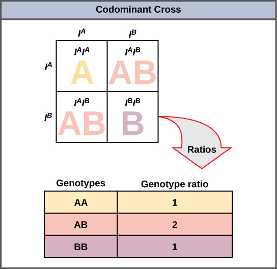

# Gene Sequencer

## Programming Assignment \#5

**Learning Objectives**

This project has multiple parts that focus on different learning objectives. The first part provides practice developing abstract data types (ADTs) using object oriented design (OOD). You will be defining and implementing classes that use file streams, references, and unit tests. The second part provides experience using the models you encapsulated int abstract data types to model a system. It also provides practice implementing operator overloading as well as algorithm design. The entire program is a good review of flow control logic, selection, vector usage and loops.

**Summary**

A Gene Sequencer is a scientific instrument used to automate the DNA sequencing process. Our gene
sequencer will be a bit different than the real thing but it provides a (hopefully) fascinating theme for practicing object oriented design and programming. One of the many perks of software engineering is that it affords you the opportunity to dive into fascinating topics with subject matter experts from a range of fields that need your expertise to help them model their problems and translate them into software.  

The first part of the project will focus on modeling the basic biology through OOD/OOP. You will code a simplified model of chromosome pairs. chromosome pairs wil be designed as collections of genes. Each gene will contains alleles. Alleles will contain specific trait data, nucleotide sequences, and will be tagged as either dominant or recessive. 


*Diagram 1 - Relationship of Alleles to Genes*


In the next part of the project you will use the classes you designed and implemented to model chromosome pairs, genes, and alleles to develop an abstraction of a Gene Sequencer. The Gene Sequencer will provide a basic UI (menu), allow a user to create chromosome pairs, import and export chromosome pairs from a file, analyze and combine (meiosis) them. 

To summarize, this is a programming assignment intended to practice object oriented design and programming (OOD/OOP). The theme of the assignment is loosely based on biology and technology specific to genetics. The theme is meant to be motivating and connect programming to real world problems. Please, don't get tripped up on the theme -- it is not necessary at all to understand genetics to program the assignment. Have fun!

## Part A

### Overview

In Part A, you will design the classes that model a chromosome pair, test the classes, and organize the project into header and source files. The program uses Object Oriented Programming (OOP) concepts to model the problem. See diagram and class definitions below for the class architecture and public interfaces.


*Diagram 2 - Class Relationships*


This is a logical model vs a physical model. Genes are abstractions of positions on a chromosome. A gene is defined by its linear position in nucleotide units of measure. Allels are variants of the same gene encoded in each of the two chromosomes (diploid organism). In our logical model we represent a chromosome as a collection of genes - each having two alleles. 


### Requirements

**Requirement #1 - Design and define the classes**

Bulleted below are the minimum classes you are required to define. You are free to add additional classes and methods. For additional information, refer to "Diagram 2 - Class Relationships" and "Code Snippet 1 - ChromosomePair class"  

* class Allele
* class Gene
* class Chromosome 
* class PunneteSquare (extra credit)


````
class ChromosomePair{

    public:

        // default constructor
        ChromosomePair();

        // outputs pheonotype -  each dominant allele in each gene
        void 	AnalyzePhenotype();     

        // configures this chromosome pair with data from filestream \'ifs\'
        void    InputFromFile(ifstream& ifs);

        // writes the state data from this chromosome pair to filestream \'ofs\'
        void    OutputToFile(ofstream& ofs);

        // adds a new Gene object \'g\' to a collection in this object
        void    AddGene(Gene g);

       	// returns a Gene object that matches a Gene with name \'n\'
        Gene    FindGene(string n);

       	// returns chrmosome from this and rhs - allele random selection or punnette probablity (optional)
        ChromosomePair operator+(ChromosomePair& rhs);

       	// returns true if chromosome pairs are equivalent
		bool operator==(Chromosme& rhs);

		// tests basic functionality of class
        bool RunUnitTests();

    private:

        vector<Gene>    genes;
        string          fileName;

};

````

*Code Snippet 1 - ChromosomePair class*


**Requirment #2 - Implement file input/output methods**

The program allows a user to write and read chromosome pair data to/from a file. Each class has methods to either write to a file, read from a file or to do both. 

* The file format is a comma separated (csv) file that contains in each row the data for a gene. The exact format in the order it should be written and read from the file for each row is;

````
<gene name>, <gene trait>, <alleleA variant>, <alleleA type>, <alleleA nucleotide sequence>, 
<alleleB variant>, <allele> type>, <alleleB nucleotide sequence>

````

* A specific example of the data for two (2) genes in csv format is below. By reading in each row of the file, a chromosome with as many genes as rows can be created.

````
UH56,hair color,blonde,recessive,TTCC,Dark,dominant,CCAGG
WPM987,Cancer-L,High,recessive,TCGC,Low,dominant,CATGG
		
````

**Requirement #3 - overload the operator+ and ==**

For a chromosome, the addition operator will be a shorthand way to combine two chromosomes. This will (kindof) simulate meiosis by selecting two of the four possible allelles. For example, when a user of your chromosome pair class does the following;

````
ChromosomePair C1, C2, C3;

	...

// creates a new chromosome pair from two existing chromosmes
// select two (2) of the four (4) alleles from each gene 
C3 = C1 + C2;
		
````

We want the result (C3) to be the 'simulated result of the biological combining of two chromosome pair pairs - mieosis. The minimal implementation will select two of the four alleles based on random selection. For extra points you can implement a more complicated and biologically accurate punnette probablity model.

**Requirement #4 - Implement unit tests for each class**

**Requirement #5 - Separate each class into its own header (.h) and implementation (.cpp) files**


* Use the correct header guards
* Class defintions go into header files
* Class method defintions (implementation) go into cpp files


**Requirement #6 - Archive project to your github account**


## Part B 

### Overview

Part B demonstrates how abstraction and encapusulation can be used to quickly assemble new components. In this part of the project you will reuse the classes you designed in Part A to 'assemble' a Gene Sequencer. The Gene Sequencer will provide the user with a basic user interface in the form of a menu, allow the user to import and export genetic data from a file, and simulate a 'power on self-test' (POST) that is typical on an embedded device. The class definition for the GeneSequencer class is provided below. You are free to add additional public or private methods and data. However, you are required to implement the specified methods in the class definition below;


## Requirements


**Requirement #7 - Design and define the Gene Sequencer class**

````
// Simulates a gene sequencer

class GeneSequencer{

    public:

	// displayes menu to user
	void DisplayUserMenu();

	// displays the dominant allele of each gene in chromosome
	void AnalyzeChromosomePair();

    // executes all unit tests on each object. Returns true if all tests pass
    bool PowerOnSelfTest();		

    // Creates a ChromosomePair object
    ChromosomePair  CreateChromosomePair();

	private:
	
		ChromosomePair c;

        // returns a ChromosomePair object from data in \'filename\'
        ChromosomePair  ImportChromosomePair(const string& fileName = \"\");

        // saves ChromosomePair \'c\' data to file \'filename\'
        void ExportChromosomePair(ChromosomePair c, const string& fileName = \"\");

        // returns chromosome from \'x\' and \'y\' genes - allele selection based on punnet probablity
        ChromosomePair  DoMeiosis(ChromosomePair x, ChromosomePair y);

        // outputs phenotype (dominant alleles for each gene) in \'c\'
        void SequenceChromosomePair(ChromosomePair c);
};

````

**Requirement #8 - Implement the user menu**


Create a user menu that displays the following choices until user selects "Exit". 

* Create chromosome
* Analyze chromosome
* Output chromosome to file
* Input chromosome from file
* Combine chromosome pairs
* Exit


**Here is an example of a valid user interaction output for the program:**

````
			> MENU
			>
			> 1 -- Create chromosome
			>
			> 2 -- Analyze chromosome
			>
			> 3 -- Output chromosome to file
			>
			> 4 -- Input chromosome from file
			>
			> 5 -- Combine chromosome pairs
			>
			> 6 -- Exit
			>
			> Please enter your choice (1 -- 5)

			User selects menu item 1

			> What is the name of the new gene? (e.g. TZ458)
			>
			> *USER INPUT: UH56*
			>
			> What is the gene trait? (e.g. eye color)
			>
			> *USER INPUT: Hair Color*
			>
			> What is the allele 1 variant ? (e.g. brown/blue/etc.)
			>
			> *USER INPUT: Blonde*
			>
			> What is allele 1 type? (e.g. dominant or recessive)
			>
			> *USER INPUT: recessive*
			>
			> What is allele 1 nucleotide sequence? (e.g. AGTC)
			>
			> *USER INPUT: TTCC*
			>
			> What is the allele 2 variant ? (e.g. brown/blue/etc.)
			>
			> *USER INPUT: Dark*
			>
			> What is allele 2 type? (e.g. dominant or recessive)
			>
			> *USER INPUT: dominant*
			>
			> What is allele 2 nucleotide sequence? (e.g. AGTC)
			>
			> *USER INPUT: CCAGG*
			>
			> Would you like to add a new gene? (y/n)
			>
			> *USER INPUT: n*

			User selects menu item 2

			> Name: UH56
			>
			> Genetic trait: Hair color
			>
			> Expressed allele: Dark -- dominant
			>
			> Nucleotide sequence: CCAGG

			User selects menu item 3

			What file would you like to import from?

			> *USER INPUT: test.txt*
			>
			> *A chromosome pair object is created and available for analysis based on
			> test.txt*

			User selects menu item 4

			What file would you like to export to?

			> *USER INPUT: test.txt*
			>
			> A line with the format described in the requirements is written to the
			> file test.txt, for example;
			>
			> UH56,Hair color,Blonde,recessive,TTCC,Dark,dominant,CCAGG

			User selects menu item 5

			> Thank you -- goodbye

````

**Requirement #9 - Implement the analyze gene method**

Analyzing a gene for our gene seqencer is equivalent to displaying the phenotype (the dominant allele for each gene). In your program the phenotype is determined by selecting the dominant or 'expressed' allele of each gene in the Chromosome and displaying the list of expressed genes as in the following example.

````
		Gene 1

		-   *Name: UH56*
		-   *Genetic trait: Hair color*
		-   *Expressed allele: Dark -- dominant *
		-   *Nucleotide sequence: CATGTAC*

		Gene 2 

		...

````


**Sections from the reading that may help**

Consult zybooks sections:

* 8.10 - 12 -- classes and classes with vectors

* 8.18 -- operator overloading

* 8.12 -- separate files for classes

* 10.1 - 2 -- filestreams

**Partner rules**

**No partners - individual work. **

**What to turn in and how**

Use Schoology to turn in your main.cpp source code file, all header (.h)
files, and all source (.cpp) files.

**Grading Rubric**

Grading is out of 100 points. If all requirements are met you will
receive 100 percent.

1.  Zero credit if:

    - You do not hand in a project -- always hand in what you have,
    partial credit is better than no credit

	- Your code does not compile to completion.

2.  You will receive up to ten points off if compiling your code
    produces *any* warnings.

3.  You will receive up to ten points off for each requirement your code
    does not meet, (please see requirements definition above).

If all requirements are met you will receive 100 percent.

**Extra credit**

Up to five (5) extra points for implmenting the chromosome pair overloaded operator+ using a Punnette Square class. The Punnet square class will correctly generate the probabilities of each possible allele pairing. The operator+ will determine the resultant allele pair based on the Punnett Square probabilities for the four (4) alleles.



*Diagram 3 - Punnette Square probabilities*


